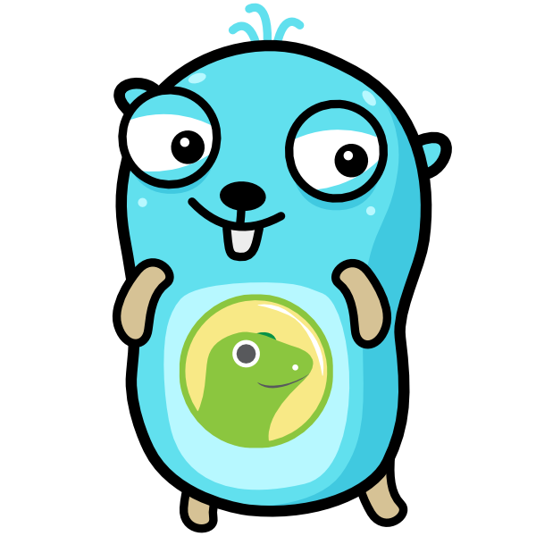

# CoinGecko API Client for Go

[](https://travis-ci.com/superoo7/go-gecko) [](https://godoc.org/github.com/superoo7/go-gecko)

Simple API Client for CoinGecko written in Go

<p align="center">
    
</p>

gopher resources from [free-gophers-pack](https://github.com/MariaLetta/free-gophers-pack)

## Available endpoint

[Refer to CoinGecko official API](https://www.coingecko.com/api)

|            Endpoint             | Status | Testing |            Function            |
| :-----------------------------: | :----: | :-----: | :----------------------------: |
|              /ping              |  [/]   |   [/]   |              Ping              |
|          /simple/price          |  [/]   |   [/]   | SimpleSinglePrice, SimplePrice |
| /simple/supported_vs_currencies |  [/]   |   [/]   |  SimpleSupportedVSCurrencies   |
|           /coins/list           |  [/]   |   [/]   |           CoinsList            |
|          /coins/market          |  [/]   |   [/]   |          CoinsMarket           |
|           /coins/{id}           |  [/]   |         |            CoinsID             |
|       /coins/{id}/history       |  [/]   |         |         CoinsIDHistory         |
|    /coins/{id}/market_chart     |  [/]   |         |       CoinsIDMarketChart       |
|        /events/countries        |  [/]   |         |        EventsCountries         |
|          /events/types          |  [/]   |         |           EventsType           |
|         /exchange_rates         |  [/]   |         |          ExchangeRate          |
|             /global             |  [/]   |         |             Global             |

## Usage

Installation with go get.

```
go get -u github.com/superoo7/go-gecko
```

For usage, checkout [Example folder for v3](/_example/v3)

For production, you might need to set time out for httpClient, here's a sample code:

```go
package main

import (
	"net/http"
	"time"

	coingecko "github.com/superoo7/go-gecko/v3"
)

func main() {
	httpClient := &http.Client{
		Timeout: time.Second * 10,
	}
	CG := coingecko.NewClient(httpClient)
}
```

## Convention

refer to https://medium.com/@marcus.olsson/writing-a-go-client-for-your-restful-api-c193a2f4998c

## License

MIT
